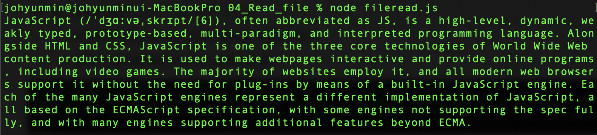
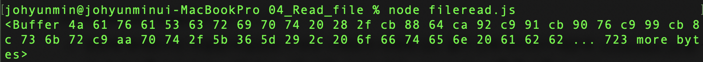

# 파일 읽기

### CRUD

- C : Create
- R : Read
- U : Update
- D : Delete


### Node.js 로 파일을 읽는 방법을 살펴보자

`fileread.js`

```javascript
var fs = require('fs');
fs.readFile('sample.txt', 'utf8', function(err, data){
  if (err) throw err;
  console.log(data);
});

```

- `var fs = require('fs');`
  - fs : File System
  - file과 관련된 기능들을 그룹핑 해놓은 모듈
  - [Node.js fs 모듈 공식문서 보기](https://nodejs.org/dist/latest-v6.x/docs/api/fs.html)


`sample.txt`

```tex
JavaScript (/ˈdʒɑːvəˌskrɪpt/[6]), often abbreviated as JS, is a high-level, dynamic, weakly typed, prototype-based, multi-paradigm, and interpreted programming language. Alongside HTML and CSS, JavaScript is one of the three core technologies of World Wide Web content production. It is used to make webpages interactive and provide online programs, including video games. The majority of websites employ it, and all modern web browsers support it without the need for plug-ins by means of a built-in JavaScript engine. Each of the many JavaScript engines represent a different implementation of JavaScript, all based on the ECMAScript specification, with some engines not supporting the spec fully, and with many engines supporting additional features beyond ECMA.

```


- `fs.readFile('sample.txt',...)`
  - 첫번째 매게변수인 파일명/파일경로가 부모 디렉토리 아래에 있는 폴더 안에 위치하기 때문에 `fileread.js`를 실행 시킬 때 해당 폴더의 위치로 이동해 준 다음 실행 시켜야 제대로 읽어와지는 것을 확인 할 수 있다.


- `fs.readFile('...', 'utf8', ...);`
  - 두번째 매게변수로 파일 인코딩 형식을 지정해주었다.
  - 'utf8'이 없으면 바이트코드로 읽어오게 된다.
  - utf8로 읽어왔을 경우:
    - 
  - otherwise:
    - 


