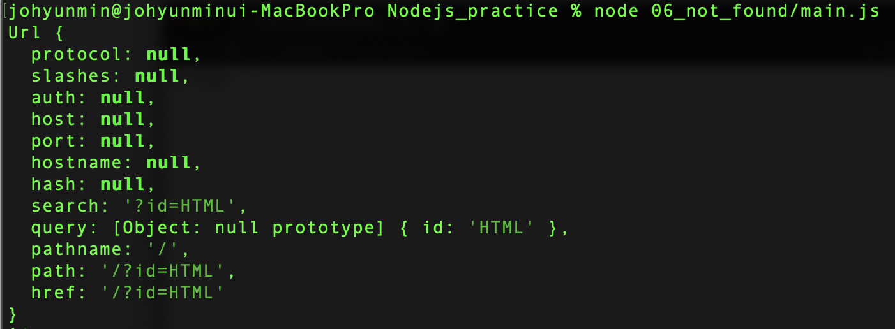
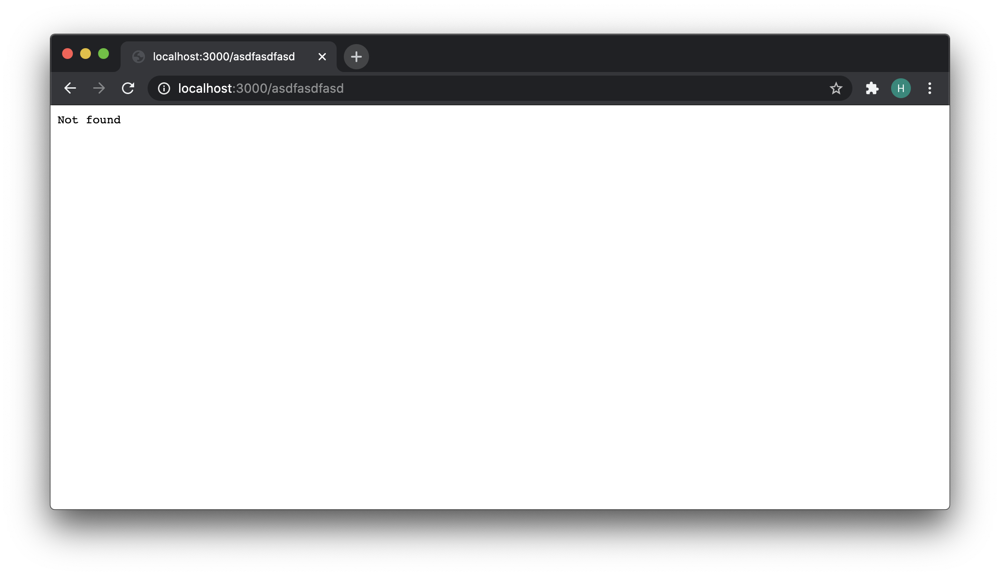

# 파일을 이용해 본문 구현
- 파일에 본문을 저장하고, Node.js의 파일 읽기 기능(fs.readFile)을 이용해서 본문을 생성하는 방법


```javascript
var http = require('http');
var fs = require('fs');
var url = require('url');

var app = http.createServer(function(request,response){
    var _url = request.url;
    var queryData = url.parse(_url, true).query;
    var pathname = url.parse(_url, true).pathname;
    var title = queryData.id;
		console.log(url.parse(_url, true));
    
  	if (pathname === '/') {
      fs.readFile(`${title}`, 'utf8', function(err, description) {
        var template = `
        <!doctype html>
        <html>
        <head>
          <title>WEB1 - ${title}</title>
          <meta charset="utf-8">
        </head>
        <body>
          <h1><a href="/">WEB</a></h1>
          <ul>
            <li><a href="/?id=HTML">HTML</a></li>
            <li><a href="/?id=CSS">CSS</a></li>
            <li><a href="/?id=JavaScript">JavaScript</a></li>
          </ul>
          <h2>${title}</h2>
          <p>${description}</p>
        </body>
        </html>
        `;
        response.writeHead(200);
        response.end(template);
      });
    } else {
      response.writeHead(404);
      response.end('Not found');
    }
});
app.listen(3000);

```

- `console.log(url.parse(_url, true));` 의 출력값:
  - 


- `var pathname = url.parse(_url, true).pathname;`  
  - pathname을 가져온다.
  - pathname을 가지고 지금 접속한 접속이 root라면(path가 없는 경로로 접속했다면) if 블럭 코드 실행
  - 그 외의 경로로 접속 했다면 else 블럭 코드 실행해서 에러임을 표시.

- `response.writeHead(200);`
  - 200은 파일을 성공적으로 찾았을 경우에 약속된 번호
- `response.writeHead(404);`
  - 404는 파일을 찾을 수 없는 경우를 가리키는 약속된 번호
- localhost:3000/asdfasdfasd 로 접속했을 경우:
    - 

* Note: 해당 폴더로 이동한 후 main.js 파일 실행 시키기.
