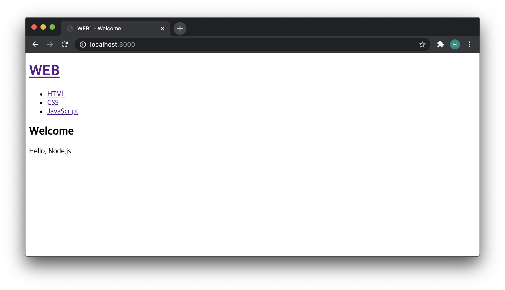

# 홈페이지 구현
- 조건문을 활용해서 홈페이지를 표현하는 방법
- root 경로인 홈페이지에 접속했을 때 나오는 페이지 구현 방법


```javascript
var http = require('http');
var fs = require('fs');
var url = require('url');

var app = http.createServer(function(request,response){
    var _url = request.url;
    var queryData = url.parse(_url, true).query;
    var pathname = url.parse(_url, true).pathname;

    if (pathname === '/') {
      if (queryData.id === undefined) {

        fs.readFile(`${queryData.id}`, 'utf8', function(err, description) {
          var title = 'Welcome';
          var description = 'Hello, Node.js';
          var template = `
          <!doctype html>
          <html>
          <head>
            <title>WEB1 - ${title}</title>
            <meta charset="utf-8">
          </head>
          <body>
            <h1><a href="/">WEB</a></h1>
            <ul>
              <li><a href="/?id=HTML">HTML</a></li>
              <li><a href="/?id=CSS">CSS</a></li>
              <li><a href="/?id=JavaScript">JavaScript</a></li>
            </ul>
            <h2>${title}</h2>
            <p>${description}</p>
          </body>
          </html>
          `;
          response.writeHead(200);
          response.end(template);
        });
      } else {
        fs.readFile(`${queryData.id}`, 'utf8', function(err, description) {
          var title = queryData.id;
          var template = `
          <!doctype html>
          <html>
          <head>
            <title>WEB1 - ${title}</title>
            <meta charset="utf-8">
          </head>
          <body>
            <h1><a href="/">WEB</a></h1>
            <ul>
              <li><a href="/?id=HTML">HTML</a></li>
              <li><a href="/?id=CSS">CSS</a></li>
              <li><a href="/?id=JavaScript">JavaScript</a></li>
            </ul>
            <h2>${title}</h2>
            <p>${description}</p>
          </body>
          </html>
          `;
          response.writeHead(200);
          response.end(template);
        });
      }
    } else {
      response.writeHead(404);
      response.end('Not found');
    }
});
app.listen(3000);
```

- `queryData.id === undefined`
  - 만약, `root` 경로인 `/`로 접속을 했다면 `queryData.id` 의 값은 `undefined` 값을 갖게 될 것이다.
  - 이를 이용하여 `queryData.id`가 `undefined`일때와 아닐때를 구분하여 홈페이지인지 다른 페이지인지를 식별해 낼 수 있다.
- root 경로로 접속
  - 


* Note: 해당 폴더로 이동한 후 main.js 파일 실행 시키기.
