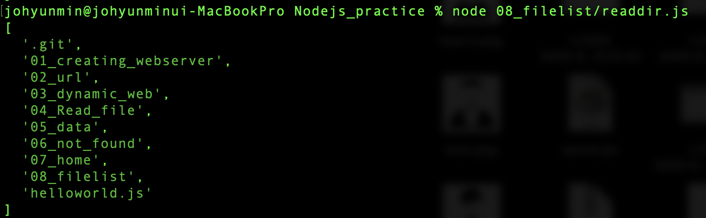
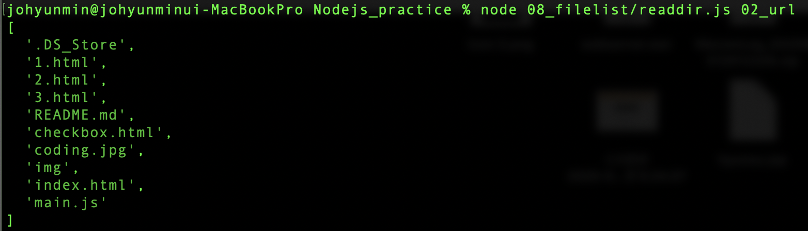

# 파일 목록 알아내기 + 콘솔에서의 입력값
- Node.js에서 특정 디렉토리 하위에 있는 파일과 디렉토리의 목록을 알아내는 방법
- 콘솔 환경에서 앱을 실행할 때 입력 값을 전달하는 방법


​       			


```javascript
var testFolder = './';
var fs = require('fs');

var args = process.argv;
if (args[2] != null) {
  testFolder += '/' + args[2];
}
fs.readdir(testFolder, function(error, filelist) {
  console.log(filelist);
});
```

- `var testFolder = './';`
  
- 대상 폴더 경로는 앱이 실행되고 있는 현재 경로 지정함.
  
- `fs.readdir()`
  - fs 모듈의 readdir 함수를 이용하여 특정 폴더 하위에 있는 파일리스트를 출력할 수 있음.
  - 첫번째 매게변수로 앱 실행 경로를 기준으로 지정하고 싶은 폴더의 경로를 입력한다.
  - 두번째 매게변수를 파일리스트를 배열로 담는 변수이다.

- `var args = process.argv;`
  - `process.argv`로 콘솔로부터 입력 받은 값을 받아올 수 있다.
  
  - 배열의 형태로 담겨진다.
  
  - `args[0]` : 첫번째 값은 Node.js가 실행되는 파일이 있는 경로.
  
  - `args[1]` : 두번째 값은 Node.js가 실행하고자 하는 js 파일의 경로
    
    - 자바로치면 main 함수가 있는 class 파일.
    
  - `args[2]` : 세번째 값은 콘솔로부터 직접 입력받은 값.
  
    ​     	   

```javascript
if (args[2] != null) {
  testFolder += '/' + args[2];
}
```

- 만약 args[2] 가 null 이 아니라면 해당 블럭이 실행되며,

- args[2] 의 값이 02_url 이라면 testFolder변수의 값은 `/02_url`로 수정이 될 것이다.

- 이에 따라, 02_url 폴더 하위에 있는 파일의 목록이 출력될 것이다.

  ​     				

- 콘솔에 입력값을 전달하지 않은 경우:

  - 

    ​       

- 콘솔에 입력값은 전달한 경우:

  - 

