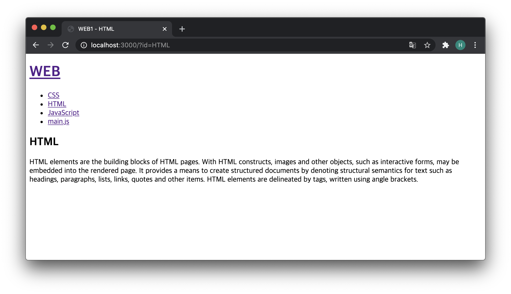
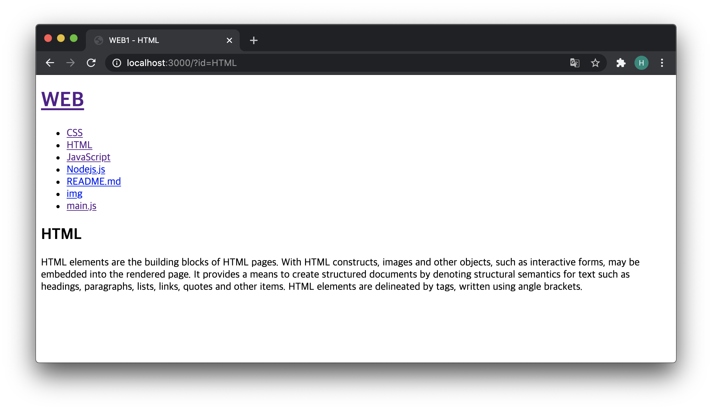

# 글목록 출력하기

- 디렉토리에 있는 파일들의 이름을 이용해서 글 목록을 생성하는 기능을 구현

​       			


```javascript
var http = require('http');
var fs = require('fs');
var url = require('url');

var app = http.createServer(function(request,response){
    var _url = request.url;
    var queryData = url.parse(_url, true).query;
    var pathname = url.parse(_url, true).pathname;
    console.log(url.parse(_url, true));
    if (pathname === '/') {
      if (queryData.id === undefined) {
        fs.readdir('09_out_using_files', function(error, filelist) {
          var title = 'Welcome';
          var description = 'Hello, Node.js';
          var list = '<ul>';
          var i = 0;
          while(i < filelist.length) {
            list += `<li><a href="/?id=${filelist[i]}">${filelist[i]}</a></li>`;
            i++;
          }
          list += '</ul>';
          var template = `
          <!doctype html>
          <html>
          <head>
            <title>WEB1 - ${title}</title>
            <meta charset="utf-8">
          </head>
          <body>
            <h1><a href="/">WEB</a></h1>
            ${list}
            <h2>${title}</h2>
            <p>${description}</p>
          </body>
          </html>
          `;
          response.writeHead(200);
          response.end(template);
          });
      } else {
        fs.readdir('09_out_using_files', function(error, filelist) {
          var title = 'Welcome';
          var description = 'Hello, Node.js';
          var list = '<ul>';
          var i = 0;
          while(i < filelist.length) {
            list += `<li><a href="/?id=${filelist[i]}">${filelist[i]}</a></li>`;
            i++;
          }
          list += '</ul>';
          fs.readFile(`./09_out_using_files/${queryData.id}`, 'utf8', function(err, description) {
            var title = queryData.id;
            var template = `
            <!doctype html>
            <html>
            <head>
              <title>WEB1 - ${title}</title>
              <meta charset="utf-8">
            </head>
            <body>
              <h1><a href="/">WEB</a></h1>
              ${list}
              <h2>${title}</h2>
              <p>${description}</p>
            </body>
            </html>
            `;
            response.writeHead(200);
            response.end(template);
          });
        });
      }
    } else {
      response.writeHead(404);
      response.end('Not found');
    }
});
app.listen(3000);

```

- 추가되는 파일은 서버 재시작 없이도 페이지 리로딩 만으로 반영이 될 수 있다.


- Before : 
  - 


- After : 
  - 
  - 새로운 파일을 디렉토리에 추가한 후 리프레시를 했더니 추가된 파일들을 포함한 리스트를 출력하였다.