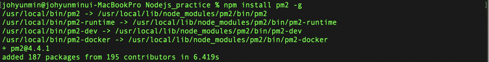
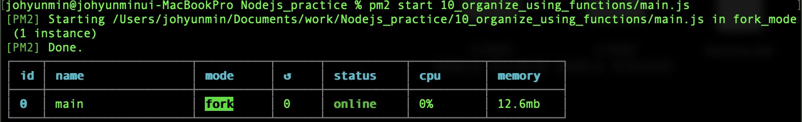
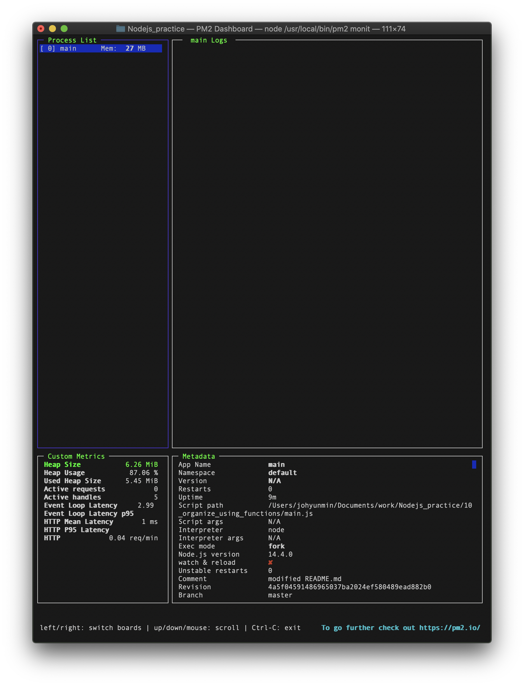
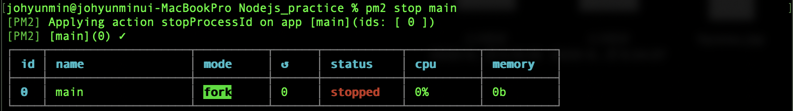

# 패키지 매니저와 PM2

- 혼자서 소프트웨어를 만드는 일은 거의 없습니다. 

- 타인의 모듈을 이용해서 소프트웨어를 만들게 됩니다. 

- 이 때 사용하는 모듈이 많아지면 여러가지 복잡한 문제가 생겨납니다. 

- 이를 관리하는 도구가 패키지 매니저입니다. 

- 이 수업에서는 대표적인 패키지 매니저인 NPM을 사용하는 법을 살펴봅니다. 

- 또 실행중인 Node.js 애플리케이션을 관리하는 프로세스 매니저 PM2의 사용법도 알아보겠습니다. 

  ​         

### NPM

- Node.js를 설치했을 때 함께 설치되는 패키지 매니저이다.

  ​         

### PM2

- Node.js를 위한 Process Manager 프로그램

- 파일이 수정되었을때 PM2는 수정이 되었음을 인식하고 자동으로 서버를 껐다 켜준다.

- NPM을 이용하여 PM2를 설치할 수 있다.

  - ```bash
    npm install pm2 -g
    ```

  - 

​            

- pm2실행하기

  - ```bash
    pm2 start 10_organize_using_functions/main.js
    ```

  - 

​                 

- Monitoring 

  - ```bash
    pm2 monit
    ```

  - 

  - main Logs 부분에 앱이 종료가 되었을 때 로그가 찍힌다.

    - 또한 pm2에 의해 종료된 앱이 바로 실행되는 모습을 확인할 수 있다.

  - `q` : monitoring 종료 명령어

​                  

- 앱 종료

  - ```bash
    pm2 stop [name of the app]
    ```

  - 

​          

- 실행된 앱의 변경된 수정사항을 인식하고 리로드해주는 명령어

  - ```bash
    pm2 start 10_organize_using_functions/main.js --watch
    ```

​              

- Error 및 수정 내역 로그 보기

  - ```bash
    pm2 log
    ```