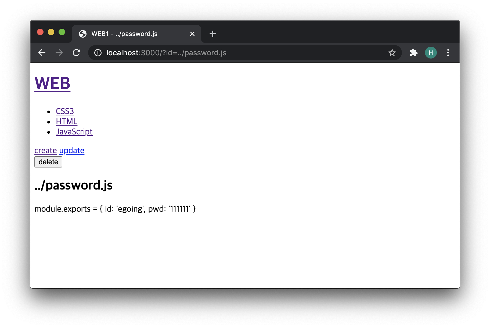
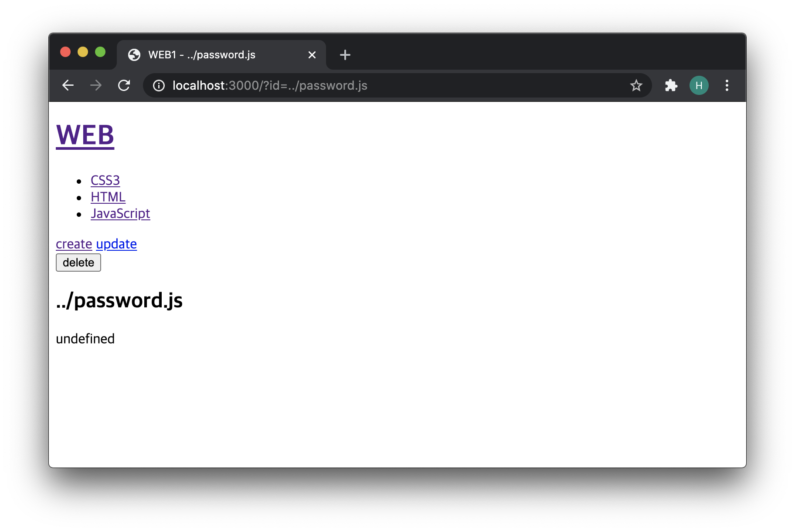

# 입력 정보에 대한 보안

- 입력정보와 관련해서 보안적으로 처리해야 할 이슈

​          

### When to use?

- 주소창을 통해 사용자가 프로젝트 상위 폴더에 접근하지 못하도록 해주고 싶을때 사용된다.

- Password.js 라는 파일에 비밀번호와 같은 노출되면 안되는 정보가 담겨있는 객체가 있다고 할 때,

  - ```javascript
    module.exports = {
      id: 'egoing',
      pwd: '111111'
    }
    ```

- 주소창에 `localhost:3000/id=../password.js` 로 입력을 하게되면 `password.js`의 내용이 화면에 출력하게 될 것이다.

  - 

- 이러한 불상사를 막기 위해 path를 parse한 객체 결과의 base 값을 사용하여 쿼리스트링으로 들어온 값을 필터링한 값을 사용한다.

  - ```javascript
    var filteredId = path.parse(queryData.id).base;
              fs.readFile(`data/${filteredId}`, 'utf8', function(err, description){
                var title = queryData.id;
                var list = template.list(filelist);
                var html = template.HTML(title, list,
                  `<h2>${title}</h2>${description}`,
                  ` <a href="/create">create</a>
                    <a href="/update?id=${title}">update</a>
                    <form action="delete_process" method="post">
                      <input type="hidden" name="id" value="${title}">
                      <input type="submit" value="delete">
                    </form>`
                );
    ```

- 코드 수정 결과:
  - 
  - password.js의 내용을 더이상 출력하지 않는 것을 볼 수 있다.

​          

- 전체코드


```javascript
var http = require('http');
var fs = require('fs');
var url = require('url');
var qs = require('querystring');
var template = require('./lib/template.js');
var path = require('path');

var app = http.createServer(function(request,response){
    var _url = request.url;
    var queryData = url.parse(_url, true).query;
    var pathname = url.parse(_url, true).pathname;
    if(pathname === '/'){
      if(queryData.id === undefined){
        fs.readdir('./data', function(error, filelist){
          var title = 'Welcome';
          var description = 'Hello, Node.js';
          var list = template.list(filelist);
          var html = template.HTML(title, list,
            `<h2>${title}</h2>${description}`,
            `<a href="/create">create</a>`
          );
          response.writeHead(200);
          response.end(html);
        });
      } else {
        fs.readdir('./data', function(error, filelist){
          var filteredId = path.parse(queryData.id).base;
          fs.readFile(`data/${filteredId}`, 'utf8', function(err, description){
            var title = queryData.id;
            var list = template.list(filelist);
            var html = template.HTML(title, list,
              `<h2>${title}</h2>${description}`,
              ` <a href="/create">create</a>
                <a href="/update?id=${title}">update</a>
                <form action="delete_process" method="post">
                  <input type="hidden" name="id" value="${title}">
                  <input type="submit" value="delete">
                </form>`
            );
            response.writeHead(200);
            response.end(html);
          });
        });
      }
    } else if(pathname === '/create'){
      fs.readdir('./data', function(error, filelist){
        var title = 'WEB - create';
        var list = template.list(filelist);
        var html = template.HTML(title, list, `
          <form action="/create_process" method="post">
            <p><input type="text" name="title" placeholder="title"></p>
            <p>
              <textarea name="description" placeholder="description"></textarea>
            </p>
            <p>
              <input type="submit">
            </p>
          </form>
        `, '');
        response.writeHead(200);
        response.end(html);
      });
    } else if(pathname === '/create_process'){
      var body = '';
      request.on('data', function(data){
          body = body + data;
      });
      request.on('end', function(){
          var post = qs.parse(body);
          var title = post.title;
          var description = post.description;
          fs.writeFile(`data/${title}`, description, 'utf8', function(err){
            response.writeHead(302, {Location: `/?id=${title}`});
            response.end();
          })
      });
    } else if(pathname === '/update'){
      fs.readdir('./data', function(error, filelist){
        var filteredId = path.parse(queryData.id).base;
        fs.readFile(`data/${filteredId}`, 'utf8', function(err, description){
          var title = queryData.id;
          var list = template.list(filelist);
          var html = template.HTML(title, list,
            `
            <form action="/update_process" method="post">
              <input type="hidden" name="id" value="${title}">
              <p><input type="text" name="title" placeholder="title" value="${title}"></p>
              <p>
                <textarea name="description" placeholder="description">${description}</textarea>
              </p>
              <p>
                <input type="submit">
              </p>
            </form>
            `,
            `<a href="/create">create</a> <a href="/update?id=${title}">update</a>`
          );
          response.writeHead(200);
          response.end(html);
        });
      });
    } else if(pathname === '/update_process'){
      var body = '';
      request.on('data', function(data){
          body = body + data;
      });
      request.on('end', function(){
          var post = qs.parse(body);
          var id = post.id;
          var title = post.title;
          var description = post.description;
          fs.rename(`data/${id}`, `data/${title}`, function(error){
            fs.writeFile(`data/${title}`, description, 'utf8', function(err){
              response.writeHead(302, {Location: `/?id=${title}`});
              response.end();
            })
          });
      });
    } else if(pathname === '/delete_process'){
      var body = '';
      request.on('data', function(data){
          body = body + data;
      });
      request.on('end', function(){
          var post = qs.parse(body);
          var id = post.id;
          var filteredId = path.parse(id).base;
          fs.unlink(`data/${filteredId}`, function(error){
            response.writeHead(302, {Location: `/`});
            response.end();
          })
      });
    } else {
      response.writeHead(404);
      response.end('Not found');
    }
});
app.listen(3000);
```
