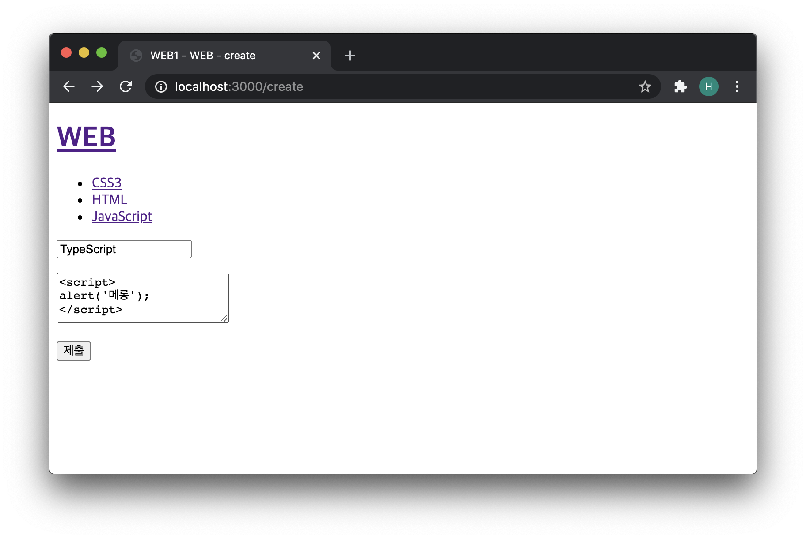
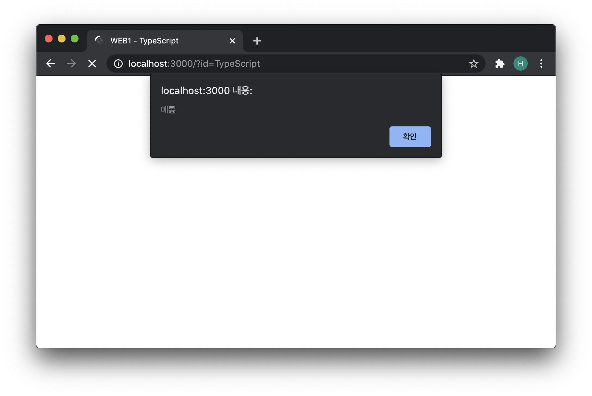
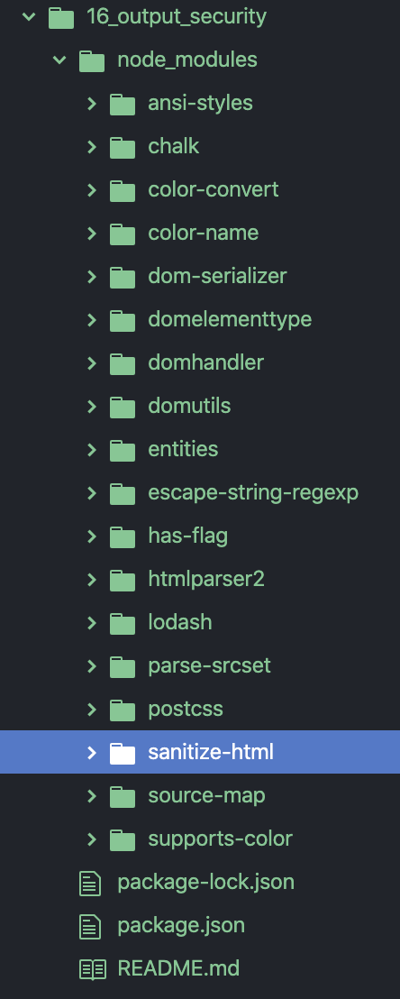
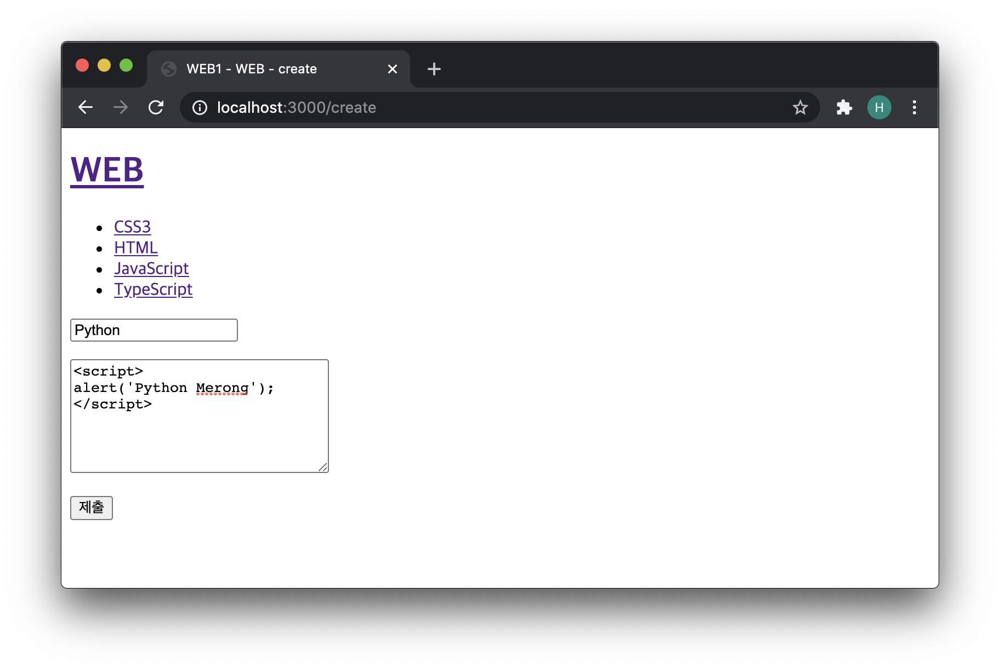
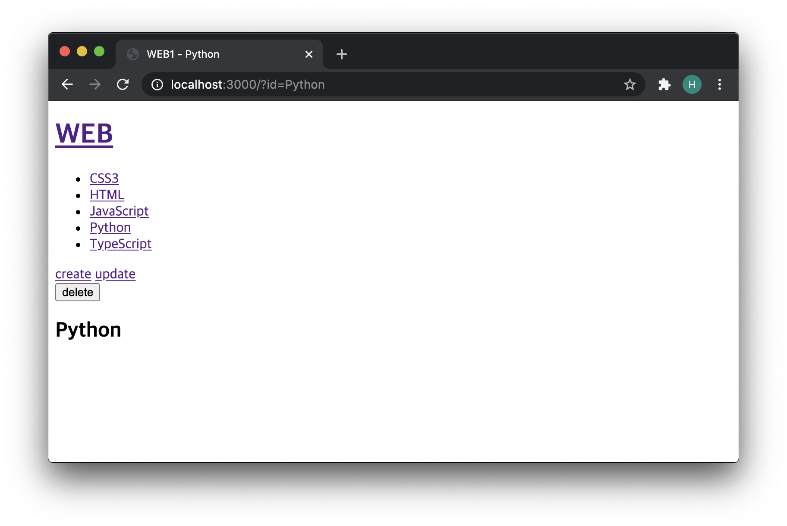
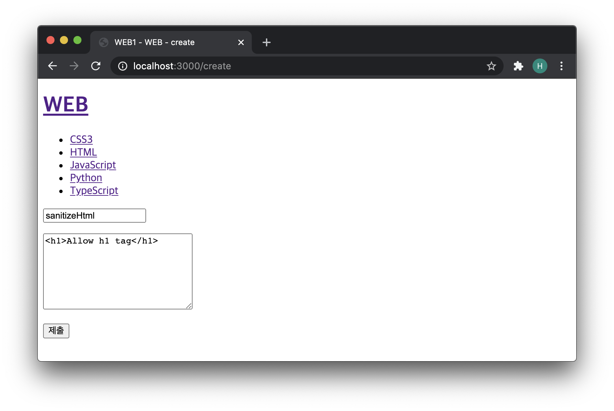
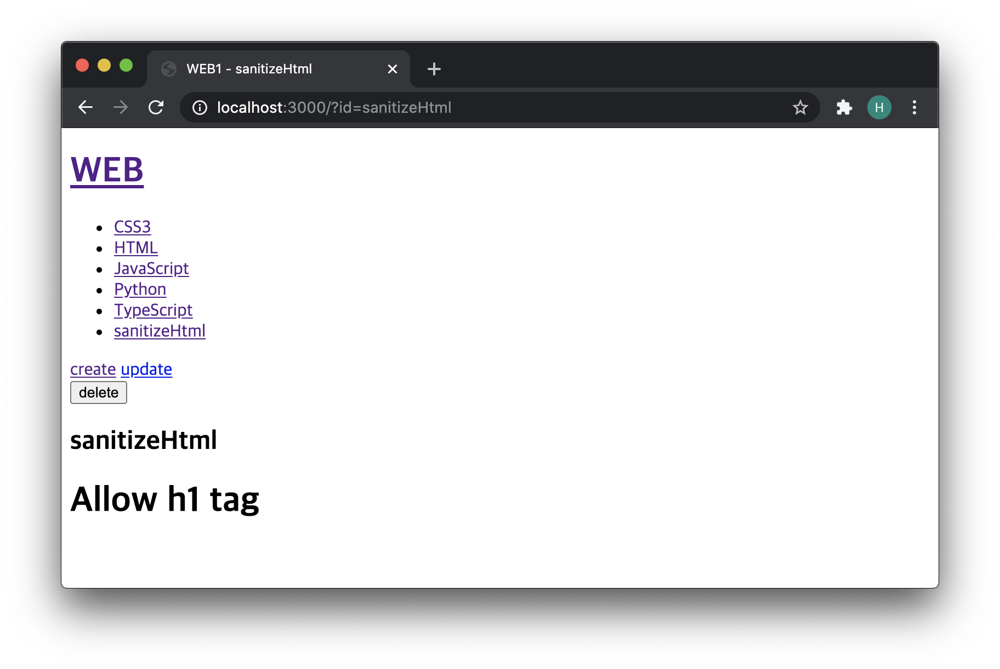

# 출력 정보에 대한 보안

- 출력정보에서 발생할 수 있는 보안적인 이슈

​            

- 만약에 텍스트를 입력하는 `textarea`에 다음과 같이 넣었다고 하자.



​         

- 제출을 하는 순간 `javascript 코드`가 실행이 되어 버리는 것을 볼 수 있다.



​         

- 입력 공간 따위에 문자가 아닌 코드 언어를 입력하여 그 코드가 실제로 실행이 되게 하는 행위는 매우 위험한 행위이다.
- 단순 `alert`가 아닌 우리의 어플리케이션을 망가트릴 수도 있고 민감한 정보를 빼어낼 수 있는 위험이 존재하기 때문이다.
- 입력 받은 코드가 실행 되지 않도록 제한시켜주어야 한다.
- 이미 누군가가 만들어 놓은 모듈을 활용해 볼 수 있다.

​              

### sanitize-html 모듈

- from dirty html to clean html
- 더러운 html 코드를 깨끗하게, 즉 안전하게 만들어 주는 기능을 담고 있는 모듈이다.

- [모듈 확인하기](https://www.npmjs.com/package/sanitize-html)


​          

### sanitize-html 모듈 설치하기

- ```bash
  npm init
  ```

  - 어플리케이션을 npm으로 관리하기 위한 절차가 시작된다.

- sanitize-html 설치

  - ```bash
    npm install -S sanitize-html
    ```

  - `-S` 의 의미는 해당 프로젝트 안에서만 이 모듈을 적용하겠다는 의미이다.

    

​             

- ```javascript
  var sanitizedTitle = sanitizeHtml(title);
  ```

  -  
  -  

​              

- ```javascript
   var sanitizedDescription = sanitizeHtml(description, {
                allowedTags:['h1']
              });
  ```

  - `sanitizeHtml 함수`의 두번째 인자로 객체를 넣을 수 있는데 `allowedTags`라하는 `프로퍼티`에 허용하고 싶은 태그를 배열의 형태로 넣을 수 있다.
  - 
  - 

​                 

### 전체코드

```javascript
var http = require('http');
var fs = require('fs');
var url = require('url');
var qs = require('querystring');
var template = require('./lib/template.js');
var path = require('path');
var sanitizeHtml = require('sanitize-html');

var app = http.createServer(function(request,response){
    var _url = request.url;
    var queryData = url.parse(_url, true).query;
    var pathname = url.parse(_url, true).pathname;
    if(pathname === '/'){
      if(queryData.id === undefined){
        fs.readdir('./data', function(error, filelist){
          var title = 'Welcome';
          var description = 'Hello, Node.js';
          var list = template.list(filelist);
          var html = template.HTML(title, list,
            `<h2>${title}</h2>${description}`,
            `<a href="/create">create</a>`
          );
          response.writeHead(200);
          response.end(html);
        });
      } else {
        fs.readdir('./data', function(error, filelist){
          var filteredId = path.parse(queryData.id).base;
          fs.readFile(`data/${filteredId}`, 'utf8', function(err, description){
            var title = queryData.id;
            var sanitizedTitle = sanitizeHtml(title);
            var sanitizedDescription = sanitizeHtml(description, {
              allowedTags:['h1']
            });
            var list = template.list(filelist);
            var html = template.HTML(sanitizedTitle, list,
              `<h2>${sanitizedTitle}</h2>${sanitizedDescription}`,
              ` <a href="/create">create</a>
                <a href="/update?id=${sanitizedTitle}">update</a>
                <form action="delete_process" method="post">
                  <input type="hidden" name="id" value="${sanitizedTitle}">
                  <input type="submit" value="delete">
                </form>`
            );
            response.writeHead(200);
            response.end(html);
          });
        });
      }
    } else if(pathname === '/create'){
      fs.readdir('./data', function(error, filelist){
        var title = 'WEB - create';
        var list = template.list(filelist);
        var html = template.HTML(title, list, `
          <form action="/create_process" method="post">
            <p><input type="text" name="title" placeholder="title"></p>
            <p>
              <textarea name="description" placeholder="description"></textarea>
            </p>
            <p>
              <input type="submit">
            </p>
          </form>
        `, '');
        response.writeHead(200);
        response.end(html);
      });
    } else if(pathname === '/create_process'){
      var body = '';
      request.on('data', function(data){
          body = body + data;
      });
      request.on('end', function(){
          var post = qs.parse(body);
          var title = post.title;
          var description = post.description;
          fs.writeFile(`data/${title}`, description, 'utf8', function(err){
            response.writeHead(302, {Location: `/?id=${title}`});
            response.end();
          })
      });
    } else if(pathname === '/update'){
      fs.readdir('./data', function(error, filelist){
        var filteredId = path.parse(queryData.id).base;
        fs.readFile(`data/${filteredId}`, 'utf8', function(err, description){
          var title = queryData.id;
          var list = template.list(filelist);
          var html = template.HTML(title, list,
            `
            <form action="/update_process" method="post">
              <input type="hidden" name="id" value="${title}">
              <p><input type="text" name="title" placeholder="title" value="${title}"></p>
              <p>
                <textarea name="description" placeholder="description">${description}</textarea>
              </p>
              <p>
                <input type="submit">
              </p>
            </form>
            `,
            `<a href="/create">create</a> <a href="/update?id=${title}">update</a>`
          );
          response.writeHead(200);
          response.end(html);
        });
      });
    } else if(pathname === '/update_process'){
      var body = '';
      request.on('data', function(data){
          body = body + data;
      });
      request.on('end', function(){
          var post = qs.parse(body);
          var id = post.id;
          var title = post.title;
          var description = post.description;
          fs.rename(`data/${id}`, `data/${title}`, function(error){
            fs.writeFile(`data/${title}`, description, 'utf8', function(err){
              response.writeHead(302, {Location: `/?id=${title}`});
              response.end();
            })
          });
      });
    } else if(pathname === '/delete_process'){
      var body = '';
      request.on('data', function(data){
          body = body + data;
      });
      request.on('end', function(){
          var post = qs.parse(body);
          var id = post.id;
          var filteredId = path.parse(id).base;
          fs.unlink(`data/${filteredId}`, function(error){
            response.writeHead(302, {Location: `/`});
            response.end();
          })
      });
    } else {
      response.writeHead(404);
      response.end('Not found');
    }
});
app.listen(3000);
```
